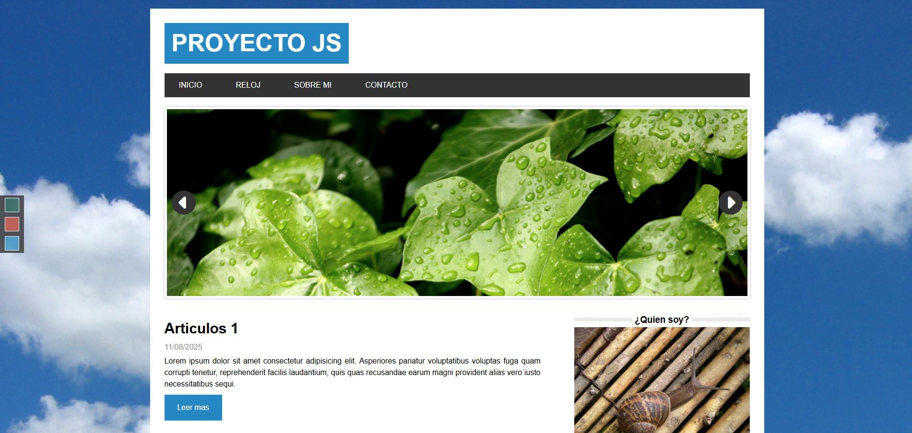
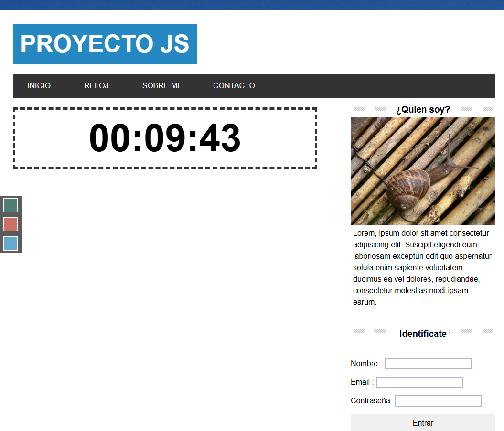
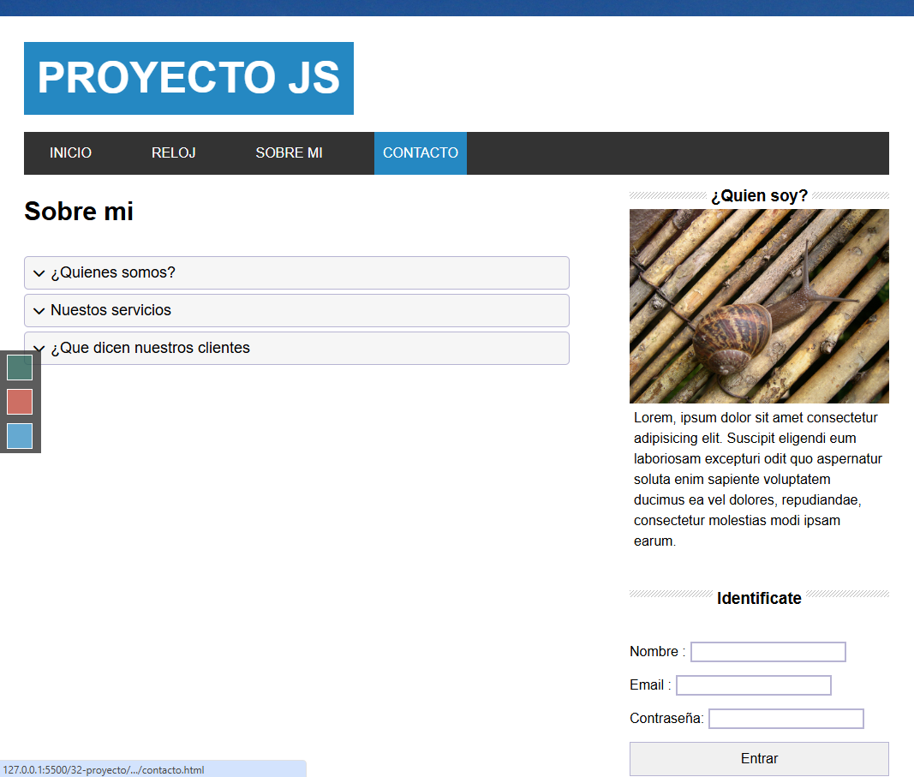
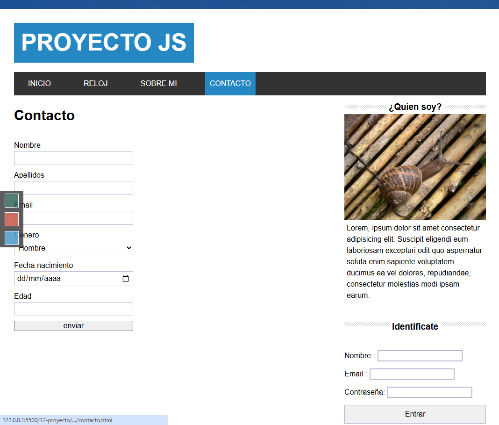

# 🌐 Proyecto de JavaScript Moderno

Este proyecto consiste en la maquetación y desarrollo de una página web moderna utilizando **HTML5**, **CSS3** (con **Flexbox** y **Grid Layout**) y **JavaScript puro** (sin frameworks). El objetivo es construir una SPA (Single Page Application) funcional, interactiva y visualmente atractiva aplicando buenas prácticas de desarrollo web.

## 🧱 Tecnologías utilizadas

- HTML5 semántico
- CSS3 moderno (Flexbox y Grid)
- JavaScript ES6+

## 🚀 Funcionalidades implementadas

1. **Maquetación completa** de una web estática con diseño responsivo y semántica correcta.
2. 🎞️ **Slider de imágenes** dinámico implementado con JavaScript puro.
3. 📰 **Listado de posts** generado dinámicamente desde un array de objetos.
4. ⬆️ **Botón "Subir arriba"** que permite volver al inicio con scroll suave.
5. 🔐 **Login simulado**: formulario que guarda el nombre de usuario en `localStorage` y mantiene la "sesión" si ya ha iniciado previamente.
6. 👤 **Sección "Sobre mí"** con un acordeón interactivo hecho con JavaScript nativo.
7. 🕒 **Reloj digital dinámico** que se actualiza en tiempo real con JavaScript moderno.
8. ✉️ **Formulario de contacto** con validación (manual o con librería).
9. 🎨 **Cambiador de temas dinámico**: selector con 3 esquemas de color diferentes para personalizar la web.

## 📁 Estructura del proyecto

```
📦 proyecto-javascript-moderno
├── index.html
├── css/
│   └── style.css
├── js/
│   ├── main.js
│   └── slider.js
├── img/
│   └── ...
└── README.md
```

## 💡 Objetivos de aprendizaje

- Practicar maquetación profesional con HTML y CSS.
- Aplicar conceptos de manipulación del DOM.
- Usar almacenamiento local (`localStorage`) para simular sesiones.
- Control de eventos, estructuras de datos, y lógica en JavaScript moderno.
- Mejorar la experiencia de usuario con scroll suave y temas personalizados.

## 📸 Capturas 





## 🧪 Cómo probar el proyecto

1. Clona el repositorio:
   ```bash
   git clone https://github.com/ajcp30/Proyecto-de-JavaScript-Moderno.git
   ```
2. Abre el archivo `index.html` en tu navegador.

> ✅ No se requieren dependencias ni instalación de paquetes adicionales.

## 📝 Licencia

Este proyecto se publica bajo la [MIT License](LICENSE).
